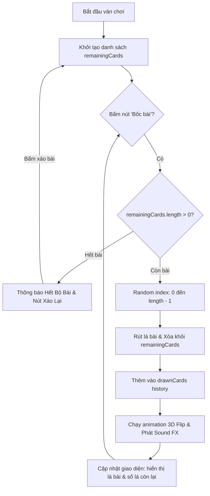

# 🍻 Kế Hoạch Phát Triển & Triển Khai Web Drinking Game (Mobile-First)

---

## 📌 1. Tổng Quan Dự Án
- **Tên dự án đề xuất**: **DrunkDeck** / **NhậuĐi - Drinking Game Online**
- **Mục tiêu**: Xây dựng một ứng dụng web dạng thẻ bài tương tác dành cho các buổi tụ họp, tiệc tùng bạn bè.
- **Trải nghiệm cốt lõi**:
  - Giao diện **Mobile-First Responsive** (tối ưu hóa hoàn toàn cho màn hình cảm ứng điện thoại, vuốt chạm mượt mà).
  - Cơ chế **bốc bài ngẫu nhiên không hoàn lại (Draw without replacement)**: Mỗi lượt rút 1 lá ngẫu nhiên trong số các lá chưa bốc, theo dõi tiến độ bộ bài, tự động báo khi hết bài để xáo lại.
  - Hiệu ứng **Lật bài 3D (3D Card Flip)** sống động, rung phản hồi (Haptic feedback trên điện thoại) và âm thanh vui nhộn (Card shuffle, Cheers, Clinking glasses).
  - Đa dạng chế độ chơi: *Khởi động, Sát phạt, Thật hay Thách, 18+ Spicy, Đấu tố mini-game*.

---

## 🎨 2. Phân Tích & Đề Xuất Công Nghệ

### 2.1. Đề xuất Framework & UI Library
| Thành phần | Công nghệ đề xuất | Lý do & Đánh giá |
| :--- | :--- | :--- |
| **Core Framework** | **React.js + Vite** | Khởi động trong 1 giây, siêu nhẹ, tương thích 100% với React 18/19, cấu hình đơn giản để deploy lên GitHub Pages hoặc Vercel. |
| **UI Framework** | **HeroUI (tiền thân là NextUI)** *hoặc* **Tailwind CSS + Framer Motion** | - Về **FeraUI**: Đây nhiều khả năng là cách viết của **HeroUI** (bộ UI hot nhất hiện nay cho React với phong cách Dark Mode Neon sang xịn) hoặc kết hợp với **Framer Motion** để tạo hiệu ứng physics/lật bài.<br>- **HeroUI** mang lại sẵn Card glassmorphism, hiệu ứng glow, modal, chip badge và button cực kỳ bắt mắt chuẩn không khí quán bar/party. |
| **Animation Engine** | **Framer Motion** | Tạo hiệu ứng vuốt (swipe-to-discard), xoay 3D lật mặt lá bài khi chạm, bung pháo hoa (canvas-confetti) khi rút lá đặc biệt. |
| **Icon System** | **Lucide Icons (`lucide-react`)** | Website **topgit.dev** sử dụng toàn bộ hệ thống icon **Lucide** (stroke 2px minimalist, đồng nhất). Dùng `lucide-react` sẽ tái hiện chuẩn xác 100% phong cách thẩm mỹ của topgit.dev. |
| **Âm thanh & Rung** | **Howler.js / Web Audio API + Navigator Vibrate** | Tạo cảm giác sướng tay khi chạm bốc bài trên điện thoại. |

---

## 🎴 3. Cơ Chế Bốc Bài & Thuật Toán Ngẫu Nhiên

### 3.1. Thuật toán Rút ngẫu nhiên không lặp lại
Mỗi bộ bài sẽ gồm một danh sách các lá bài (`cards`). Trong quá trình chơi:
1. **Khởi tạo ván chơi**: Copy danh sách gốc sang mảng `remainingDeck`.
2. **Khi người chơi bấm "Bốc Bài"**:
   - Kiểm tra nếu `remainingDeck.length === 0` ➔ Hiển thị màn hình thông báo "Đã hết bài!" và kích hoạt nút "Xáo lại bài (Reshuffle)".
   - Nếu còn bài: Tạo chỉ số ngẫu nhiên:  
     $$\text{randomIndex} = \lfloor \text{Math.random()} \times \text{remainingDeck.length} \rfloor$$
   - Tách lá bài đó ra khỏi `remainingDeck` bằng `splice(randomIndex, 1)`.
   - Đẩy lá bài vừa rút vào `drawnHistory` (danh sách lịch sử các lá đã rút).
   - Hiển thị hiệu ứng lật thẻ bài với nội dung của lá vừa rút.
3. **Bộ đếm tiến độ**: Hiển thị rõ số lượng bài còn lại (Ví dụ: `Còn lại 18/50 lá`).



---

## 📦 4. Cấu Trúc Dữ Liệu Mẫu (Mockup Data)

Mỗi lá bài được phân loại theo danh mục, độ cay cú và hình phạt/thử thách:

```json
[
  {
    "id": "card_01",
    "category": "dare",
    "categoryName": "Thách Thức",
    "badgeColor": "from-red-500 to-pink-500",
    "icon": "Flame",
    "title": "Gọi cho người yêu cũ",
    "description": "Gọi điện cho người yêu cũ hoặc crush gần nhất nói 'Em nhớ anh/Anh nhớ em' trong 10 giây.",
    "penalty": "Không dám làm: Uống 3 ly!",
    "drinkCount": 3
  },
  {
    "id": "card_02",
    "category": "rule",
    "categoryName": "Luật Nhóm",
    "badgeColor": "from-purple-500 to-indigo-500",
    "icon": "ShieldAlert",
    "title": "Cấm chỉ tay",
    "description": "Từ giờ đến khi có lá Luật mới, bất kỳ ai lấy tay chỉ vào người khác sẽ phải uống ngay 1 ngụm.",
    "penalty": "Hiệu lực toàn bàn",
    "drinkCount": 1
  },
  {
    "id": "card_03",
    "category": "truth",
    "categoryName": "Thật Thà",
    "badgeColor": "from-blue-500 to-cyan-500",
    "icon": "MessageCircleQuestion",
    "title": "Bí mật xấu hổ",
    "description": "Kể lại một lần 'quê' nhất trong đời mà hội bạn chưa ai biết.",
    "penalty": "Từ chối trả lời: Uống 2 ly!",
    "drinkCount": 2
  },
  {
    "id": "card_04",
    "category": "all",
    "categoryName": "Tất Cả Cùng Chơi",
    "badgeColor": "from-amber-500 to-orange-500",
    "icon": "Users",
    "title": "Nối từ nhanh",
    "description": "Người bốc ra một từ, theo chiều kim đồng hồ mỗi người nối 1 từ trong 3 giây. Ai ấp úng hoặc lặp lại thì uống!",
    "penalty": "Người thua: Uống 2 ly",
    "drinkCount": 2
  },
  {
    "id": "card_05",
    "category": "lucky",
    "categoryName": "Kim Bài Miễn Tử",
    "badgeColor": "from-emerald-500 to-teal-500",
    "icon": "Crown",
    "title": "Chuyển giao quyền lực",
    "description": "Giữ lá bài này. Trong suốt ván chơi, bạn có quyền chuyển 1 hình phạt uống bất kỳ cho 1 người bạn chỉ định.",
    "penalty": "Có hiệu lực 1 lần duy nhất",
    "drinkCount": 0
  }
]
```

---

## 📱 5. Thiết Kế UI/UX Cho Màn Hình Điện Thoại (Mobile-First)

1. **Khung nhìn chuẩn Mobile (Viewport Optimization)**:
   - Giới hạn chiều rộng nội dung tối đa `max-w-md` ở giữa màn hình (giống trải nghiệm Native App trên iPhone/Android).
   - Tắt hiện tượng zoom khi double tap (`touch-action: manipulation`).
2. **Khu vực Thẻ Bài Trung Tâm**:
   - Thẻ bài tỷ lệ chuẩn Tarot/Playing Card (`aspect-[2/3]` hoặc `w-72 h-[420px]`).
   - Mặt lưng: Họa tiết huyền bí/neon hiện đại, logo Drinking Game phát sáng pulse.
   - Mặt trước: Phân màu theo Category, icon Lucide rõ ràng, font chữ lớn dễ đọc trong môi trường tiệc thiếu sáng.
3. **Thanh Điều Khiển Dưới Cùng (Bottom Action Bar)**:
   - Nút **"BỐC BÀI"** to bản, đặt ngay tầm ngón tay cái (Thumb-friendly design).
   - Nút phụ: **"Xáo bài"**, **"Lịch sử các lá đã bốc"**, **"Cài đặt/Âm thanh"**.
4. **Hiệu ứng Thẩm Mỹ (Dark Glassmorphism)**:
   - Nền tối đa chiều sâu: Gradient tím đậm - đen (`#0f0c20` đến `#05050a`), ánh sáng viền neon xanh/hồng.
   - Hiệu ứng pháo hoa khi bốc trúng thẻ bài cấp độ "Sát Phạt" hoặc "Kim Bài Miễn Tử".

---

## 🏗️ 6. Kiến Trúc Cây Thư Mục Dự Án

```
drinking-game-ui/
├── public/
│   ├── sounds/              # File âm thanh: flip.mp3, shuffle.mp3, cheers.mp3
│   └── favicon.svg          # Icon web
├── src/
│   ├── assets/              # Hình ảnh minh họa, logo
│   ├── components/
│   │   ├── Card3D.jsx       # Thẻ bài lật 3D (Front & Back)
│   │   ├── DeckStack.jsx    # Hiệu ứng chồng bài xếp lớp mô phỏng bộ bài thật
│   │   ├── Controls.jsx     # Nút bốc bài, xáo bài, nút reset
│   │   ├── Header.jsx       # Thanh tiêu đề, nút tắt/bật âm thanh, đếm số bài còn lại
│   │   ├── HistoryModal.jsx # Xem lại danh sách các lá bài đã bốc trong ván
│   │   └── ModePicker.jsx   # Bộ lọc chế độ chơi (Chill, Bựa, 18+, Cực gắt)
│   ├── data/
│   │   └── cardsData.js     # Mockup dữ liệu 40-60 thẻ bài drinking game
│   ├── hooks/
│   │   ├── useGameDeck.js   # Custom Hook quản lý logic bốc ngẫu nhiên & lịch sử
│   │   └── useSoundEffects.js # Hook quản lý phát âm thanh & rung điện thoại
│   ├── styles/
│   │   └── index.css        # Tailwind directives & CSS 3D transforms
│   ├── App.jsx              # Main App layout & logic
│   └── main.jsx
├── index.html
├── package.json
├── tailwind.config.js
└── vite.config.js
```

---

## 🚀 7. Quy Trình Triển Khai & Deploy Lên Git

### Cách 1: Deploy lên Vercel thông qua GitHub (Khuyên dùng nhất ⭐⭐⭐)
> **Lợi ích**: Tự động 100%, không cần cấu hình base path, tốc độ truy cập nhanh toàn cầu, cấp chứng chỉ HTTPS miễn phí.

1. **Khởi tạo Git và đẩy code lên GitHub**:
   ```bash
   git init
   git add .
   git commit -m "feat: initial drinking game app"
   git branch -M main
   git remote add origin https://github.com/<username>/<repo-name>.git
   git push -u origin main
   ```
2. **Kết nối Vercel**:
   - Truy cập [vercel.com](https://vercel.com) và đăng nhập bằng tài khoản GitHub.
   - Bấm **"Add New Project"** ➔ Chọn repository vừa tạo.
   - Vercel tự động nhận diện framework **Vite**, giữ nguyên thiết lập mặc định và bấm **"Deploy"**.
   - Sau ~30 giây, ứng dụng sẽ online với URL dạng `https://ten-du-an.vercel.app`. Mỗi khi push code mới lên branch `main`, Vercel sẽ tự động build lại.

---

### Cách 2: Deploy trực tiếp lên GitHub Pages (Miễn phí trên GitHub)

1. **Cấu hình `vite.config.js`**:
   Thêm thuộc tính `base` tương ứng với tên repository trên GitHub:
   ```javascript
   import { defineConfig } from 'vite'
   import react from '@vitejs/plugin-react'

   export default defineConfig({
     plugins: [react()],
     base: '/<ten-repo-tren-github>/', // Ví dụ: '/drinking-game/'
   })
   ```

2. **Tạo GitHub Actions Workflow tự động deploy**:
   Tạo file `.github/workflows/deploy.yml`:
   ```yaml
   name: Deploy to GitHub Pages

   on:
     push:
       branches: [ main ]

   permissions:
     contents: read
     pages: write
     id-token: write

   concurrency:
     group: 'pages'
     cancel-in-progress: true

   jobs:
     deploy:
       environment:
         name: github-pages
         url: ${{ steps.deployment.outputs.page_url }}
       runs-on: ubuntu-latest
       steps:
         - name: Checkout
           uses: actions/checkout@v4

         - name: Setup Node
           uses: actions/setup-node@v4
           with:
             node-version: 20
             cache: 'npm'

         - name: Install dependencies
           run: npm ci

         - name: Build
           run: npm run build

         - name: Setup Pages
           uses: actions/configure-pages@v4

         - name: Upload artifact
           uses: actions/upload-pages-artifact@v3
           with:
             path: './dist'

         - name: Deploy to GitHub Pages
           id: deployment
           uses: actions/deploy-pages@v4
   ```
3. **Kích hoạt trên GitHub**:
   - Vào Settings của repository trên GitHub ➔ Mục **Pages**.
   - Tại phần **Source**, chọn **GitHub Actions**.
   - Push code lên nhánh `main`, hệ thống sẽ tự động chạy và web sẽ live tại `https://<username>.github.io/<ten-repo>/`.

---

## 🗓️ 8. Lộ Trình Thực Hiện Từng Bước (Checklist)

- [ ] **Giai đoạn 1**: Khởi tạo project React.js với Vite, cài đặt Tailwind CSS, HeroUI và Lucide Icons (`lucide-react`).
- [ ] **Giai đoạn 2**: Xây dựng file Mockup Data phong phú (`cardsData.js`) gồm 50 lá với đầy đủ thể loại.
- [ ] **Giai đoạn 3**: Viết Custom Hook `useGameDeck` xử lý bốc ngẫu nhiên không trùng, đếm bài và reset ván.
- [ ] **Giai đoạn 4**: Thiết kế Component Thẻ Bài 3D (`Card3D.jsx`) với CSS 3D transform + Framer Motion.
- [ ] **Giai đoạn 5**: Tích hợp Web Audio API (âm thanh lật bài, cạn ly) và Haptic Vibration cho điện thoại.
- [ ] **Giai đoạn 6**: Kiểm thử hiển thị trên các màn hình điện thoại thực tế (iOS Safari, Android Chrome).
- [ ] **Giai đoạn 7**: Khởi tạo Git Repo và cấu hình Deploy tự động lên Vercel / GitHub Pages.
